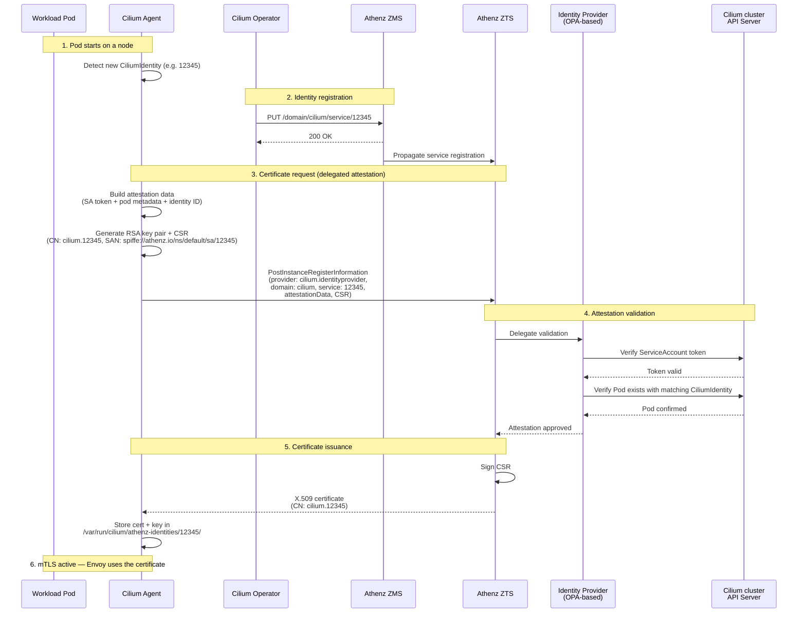
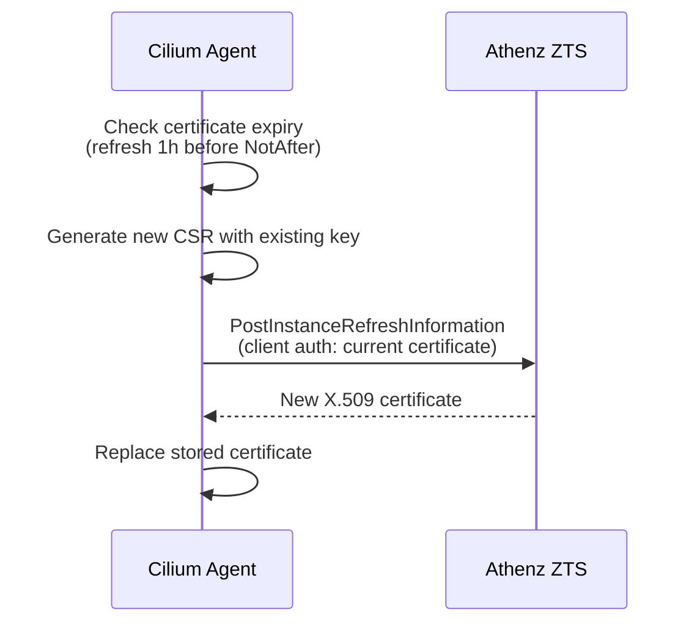
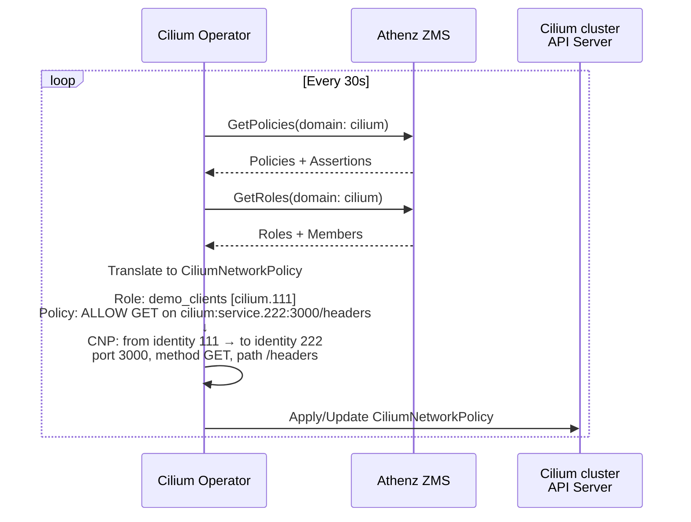
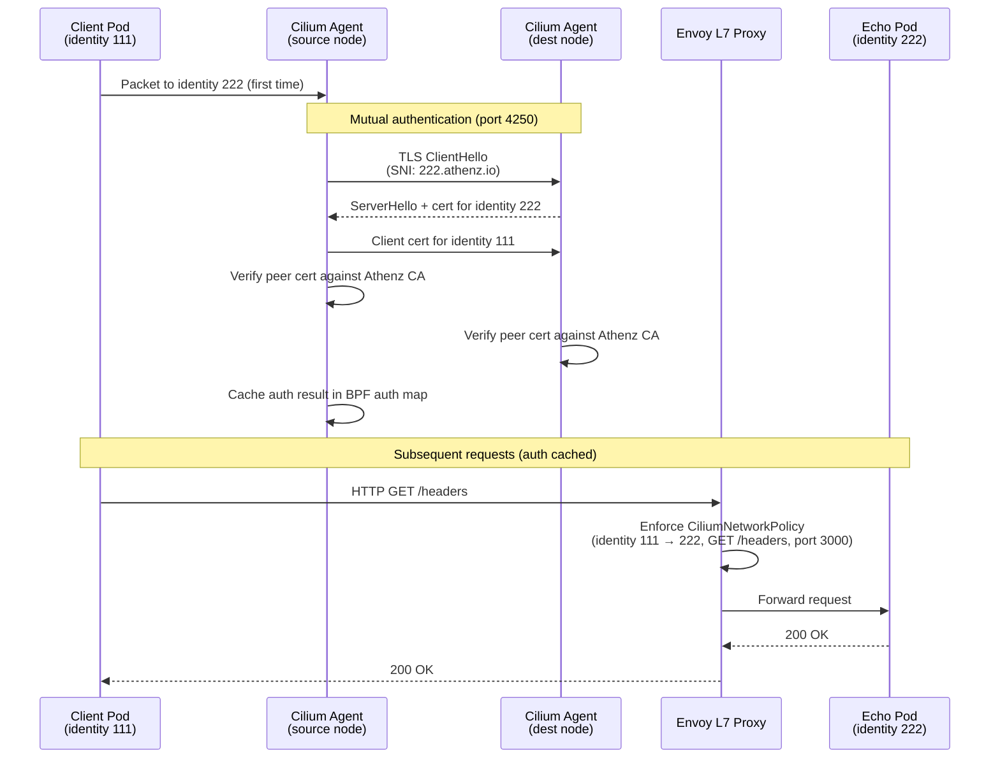

# cilium-athenz

Integrates [Athenz](https://www.athenz.io/) RBAC with [Cilium](https://cilium.io/) to provide identity-based mutual TLS authentication and policy enforcement for Kubernetes workloads.

Cilium agents and operators obtain X.509 certificates from Athenz (via ZTS) instead of SPIRE, and the Cilium operator synchronizes Athenz policies to enforce HTTP-level access control between pods.

## Architecture

```
┌─ Athenz cluster (kind-cilium-athenz) ─────────────────────────────────────────┐
│                                                                               │
│  ┌──────────────────┐       ┌──────────────────┐       ┌───────────────────┐  │
│  │ Athenz ZMS       │       │ Athenz ZTS       │       │ Identity Provider │  │
│  │ (policy)         │       │ (cert issuer)    │       │ (OPA-based)       │  │
│  └────────▲─────────┘       └──▲──────────┬────┘       └──────▲────────────┘  │
│           │                    │          │  delegate         │               │
│           │                    │          │  attestation      │               │
│           │                    │          └───────────────────┘               │
└───────────┼────────────────────┼──────────────────────────────┼───────────────┘
            │                    │                              │
            │ register identities│ request X.509 cert           │ verify pod
            │ / fetch policies   │ (CSR + attestation)          │ existence
            │                    │                              │
┌───────────┼────────────────────┼──────────────────────────────┼───────────────┐
│           │                    │                              │               │
│  ┌────────┴─────────┐        ┌─┴────────────────┐       ┌─────┴─────────────┐ │
│  │ Cilium Operator  │        │ Cilium Agent     │       │ Workload Pods     │ │
│  │                  │        │ (holds certs per │       │ (no Athenz        │ │
│  │                  │        │  identity, does  │       │  awareness)       │ │
│  │                  │        │  mTLS on behalf) │       │                   │ │
│  └──────────────────┘        └────────┬─────────┘       │ ┌─────┐  ┌─────┐  │ │
│                                       │                 │ │Pod A│  │Pod B│  │ │
│                                       │ enforce policy  │ └──┬──┘  └──▲──┘  │ │
│                                       │ + mTLS auth     │    │        │     │ │
│                                       └─────────────────┼────┴────────┘     │ │
│                                                         │  mTLS-protected   │ │
│                                                         │  traffic          │ │
│                                                         └───────────────────┘ │
│                              Cilium cluster (kind-cilium)                     │
└───────────────────────────────────────────────────────────────────────────────┘
```

| Component | Role |
|-----------|------|
| **Athenz ZMS** | Policy management server. Stores domains, roles, and policies. |
| **Athenz ZTS** | Certificate authority. Issues X.509 certificates after attestation validation. |
| **Identity Provider** | OPA-based service that verifies attestation data (ServiceAccount token + pod metadata) by querying the Cilium cluster's Kubernetes API. |
| **Cilium Operator** | Registers workload identities in Athenz, fetches roles/policies from ZMS, and generates `CiliumNetworkPolicy` resources. |
| **Cilium Agent** | Requests X.509 certificates from ZTS on behalf of workload pods (delegated attestation) and performs agent-to-agent mTLS handshakes. |

## Repository Structure

| Directory | Description |
|-----------|-------------|
| `cilium/` | Forked Cilium with Athenz authentication support (submodule: `integration-athenz` branch) |
| `athenz-distribution/` | Athenz deployment scripts (submodule) |
| `athenz-identityprovider/` | OPA-based identity provider that bridges Kubernetes ServiceAccount tokens to Athenz identities |
| `athenz-cilium/` | Glue manifests and Makefile targets for connecting Athenz to the Cilium cluster |
| `patchfiles/` | Overlay files applied on top of submodules (`make patch`) |

## Prerequisites

- [Docker](https://docs.docker.com/get-docker/)
- [kind](https://kind.sigs.k8s.io/)
- [kubectl](https://kubernetes.io/docs/tasks/tools/)
- [Cilium CLI](https://docs.cilium.io/en/stable/gettingstarted/k8s-install-default/#install-the-cilium-cli)
- GNU Make

## Quick Start

```bash
# 0. Submodule setup
git submodule update --init --recursive

# 1. Apply patch files to submodules
make patch

# 2. Create two kind clusters (Athenz cluster + Cilium cluster)
make kind-setup

# 3. Deploy Athenz (ZMS + ZTS)
make deploy-athenz

# 4. Deploy the identity provider
make deploy-identityprovider

# 5. Deploy Cilium with Athenz mTLS enabled
make deploy-cilium
```

## Testing

Deploy a test workload (echo server + client pod) with an Athenz policy that allows `GET /headers`:

```bash
make deploy-test-workload
```

Verify that allowed requests succeed and unauthorized requests are denied:

```bash
# Allowed: GET /headers -> 200
kubectl --context kind-cilium -n default exec -it pod-worker -- \
  curl -s -o /dev/null -w "%{http_code}" http://echo:3000/headers

# Denied: GET /headers-1 -> Access denied
kubectl --context kind-cilium -n default exec -it pod-worker -- \
  curl http://echo:3000/headers-1
```

Verify mTLS is active (check BPF auth map on the node hosting the echo pod):

```bash
# Find the cilium agent pod on the node where echo runs
ECHO_NODE=$(kubectl --context kind-cilium get pod echo -o jsonpath='{.spec.nodeName}')
CILIUM_POD=$(kubectl --context kind-cilium -n kube-system get pods -l k8s-app=cilium \
  --field-selector spec.nodeName=$ECHO_NODE -o jsonpath='{.items[0].metadata.name}')

# Check auth map entries (should show spire auth type with valid expiration)
kubectl --context kind-cilium -n kube-system exec $CILIUM_POD -c cilium-agent -- \
  cilium-dbg bpf auth list

# SRC IDENTITY   DST IDENTITY   REMOTE NODE ID   AUTH TYPE   EXPIRATION
# 31400          46344          0                spire       2026-07-06 14:42:31 +0000 UTC
```

Clean up:

```bash
make clean-test-workload
```

## Benchmark

Compare latency between plain (no auth) and Athenz-authenticated paths using [vegeta](https://github.com/tsenart/vegeta):

```bash
make deploy-benchmark-workload
make run-benchmark
make clean-benchmark-workload
```

Default parameters: `BENCH_RATE=100`, `BENCH_WORKERS=100`, `BENCH_DURATION=30s`, `BENCH_KEEPALIVE=false`.

Override as needed:

```bash
make run-benchmark BENCH_RATE=200 BENCH_DURATION=60s
```

### Example Results

| Metric | Plain | Auth (mTLS + policy) |
|--------|------:|---------------------:|
| Requests | 3000 @ 100 rps | 3000 @ 100 rps |
| Mean latency | 335 us | 834 us |
| P50 latency | 303 us | 397 us |
| P95 latency | 462 us | 704 us |
| P99 latency | 673 us | 1.25 ms |
| Max latency | 22.6 ms | 144.5 ms |
| Success ratio | 100% | 100% |

<details>
<summary>Raw output</summary>

```
===== benchmark: plain =====
Requests      [total, rate]            3000, 100.03
Duration      [total, attack, wait]    29.990678682s, 29.990389848s, 288.834µs
Latencies     [mean, 50, 95, 99, max]  334.982µs, 303.042µs, 461.834µs, 673.167µs, 22.582333ms
Bytes In      [total, mean]            765000, 255.00
Bytes Out     [total, mean]            0, 0.00
Success       [ratio]                  100.00%
Status Codes  [code:count]             200:3000
Error Set:

===== benchmark: auth =====
Requests      [total, rate]            3000, 100.03
Duration      [total, attack, wait]    29.991092889s, 29.990287181s, 805.708µs
Latencies     [mean, 50, 95, 99, max]  833.799µs, 397.292µs, 703.667µs, 1.249167ms, 144.48925ms
Bytes In      [total, mean]            1368000, 456.00
Bytes Out     [total, mean]            0, 0.00
Success       [ratio]                  100.00%
Status Codes  [code:count]             200:3000
Error Set:
```

</details>

<details>
<summary>Sidecar Loadtest</summary>

```
% make test-kubernetes-athenz-envoy-loadtest
CASE=client2echoserver; kubectl -n athenz exec deployment/vegeta -- /bin/sh -c "echo \"GET https://client.athenz.svc.cluster.local/$CASE\" | vegeta attack -workers=100 -rate=100 -duration=30s -keepalive false | tee /data/$CASE.bin | vegeta report"
Requests      [total, rate]            3000, 100.03
Duration      [total, attack, wait]    29.993097556s, 29.990822056s, 2.2755ms
Latencies     [mean, 50, 95, 99, max]  7.247183ms, 2.106084ms, 35.507ms, 140.310542ms, 272.718167ms
Bytes In      [total, mean]            21762000, 7254.00
Bytes Out     [total, mean]            0, 0.00
Success       [ratio]                  100.00%
Status Codes  [code:count]             200:3000
Error Set:
CASE=client2extauthz; kubectl -n athenz exec deployment/vegeta -- /bin/sh -c "echo \"GET https://client.athenz.svc.cluster.local/$CASE\" | vegeta attack -workers=100 -rate=100 -duration=30s -keepalive false | tee /data/$CASE.bin | vegeta report"
Requests      [total, rate]            3000, 100.03
Duration      [total, attack, wait]    30.084819932s, 29.990192348s, 94.627584ms
Latencies     [mean, 50, 95, 99, max]  17.890576ms, 2.62875ms, 105.842375ms, 267.291875ms, 612.264375ms
Bytes In      [total, mean]            22755000, 7585.00
Bytes Out     [total, mean]            0, 0.00
Success       [ratio]                  100.00%
Status Codes  [code:count]             200:3000
Error Set:
CASE=client2extauthzmtls; kubectl -n athenz exec deployment/vegeta -- /bin/sh -c "echo \"GET https://client.athenz.svc.cluster.local/$CASE\" | vegeta attack -workers=100 -rate=100 -duration=30s -keepalive false | tee /data/$CASE.bin | vegeta report"
Requests      [total, rate]            3000, 100.03
Duration      [total, attack, wait]    29.993742806s, 29.990663139s, 3.079667ms
Latencies     [mean, 50, 95, 99, max]  13.935723ms, 2.875416ms, 74.733292ms, 237.327208ms, 493.842708ms
Bytes In      [total, mean]            29447776, 9815.93
Bytes Out     [total, mean]            0, 0.00
Success       [ratio]                  100.00%
Status Codes  [code:count]             200:3000
Error Set:
CASE=client2filterauthzmtls; kubectl -n athenz exec deployment/vegeta -- /bin/sh -c "echo \"GET https://client.athenz.svc.cluster.local/$CASE\" | vegeta attack -workers=100 -rate=100 -duration=30s -keepalive false | tee /data/$CASE.bin | vegeta report"
Requests      [total, rate]            3000, 100.03
Duration      [total, attack, wait]    29.993186598s, 29.990697973s, 2.488625ms
Latencies     [mean, 50, 95, 99, max]  2.415141ms, 2.364167ms, 3.026458ms, 3.567791ms, 13.458083ms
Bytes In      [total, mean]            22605000, 7535.00
Bytes Out     [total, mean]            0, 0.00
Success       [ratio]                  100.00%
Status Codes  [code:count]             200:3000
Error Set:
CASE=client2filterauthzjwt; kubectl -n athenz exec deployment/vegeta -- /bin/sh -c "echo \"GET https://client.athenz.svc.cluster.local/$CASE\" | vegeta attack -workers=100 -rate=100 -duration=30s -keepalive false | tee /data/$CASE.bin | vegeta report"
Requests      [total, rate]            3000, 100.03
Duration      [total, attack, wait]    29.993356973s, 29.990920973s, 2.436ms
Latencies     [mean, 50, 95, 99, max]  5.98144ms, 2.579166ms, 7.87375ms, 96.936417ms, 216.02375ms
Bytes In      [total, mean]            23026395, 7675.47
Bytes Out     [total, mean]            0, 0.00
Success       [ratio]                  100.00%
Status Codes  [code:count]             200:3000
Error Set:
CASE=client2filterauthzmtlsjwt; kubectl -n athenz exec deployment/vegeta -- /bin/sh -c "echo \"GET https://client.athenz.svc.cluster.local/$CASE\" | vegeta attack -workers=100 -rate=100 -duration=30s -keepalive false | tee /data/$CASE.bin | vegeta report"
Requests      [total, rate]            3000, 100.03
Duration      [total, attack, wait]    29.999663014s, 29.990820264s, 8.84275ms
Latencies     [mean, 50, 95, 99, max]  13.169432ms, 2.581917ms, 83.853166ms, 182.894042ms, 373.663167ms
Bytes In      [total, mean]            29801264, 9933.75
Bytes Out     [total, mean]            0, 0.00
Success       [ratio]                  100.00%
Status Codes  [code:count]             200:3000
Error Set:
CASE=client2webhookauthzmtls; kubectl -n athenz exec deployment/vegeta -- /bin/sh -c "echo \"GET https://client.athenz.svc.cluster.local/$CASE\" | vegeta attack -workers=100 -rate=100 -duration=30s -keepalive false | tee /data/$CASE.bin | vegeta report"
Requests      [total, rate]            3000, 100.03
Duration      [total, attack, wait]    29.994868015s, 29.990997181s, 3.870834ms
Latencies     [mean, 50, 95, 99, max]  3.219626ms, 3.075ms, 4.068333ms, 5.10625ms, 22.112625ms
Bytes In      [total, mean]            22593496, 7531.17
Bytes Out     [total, mean]            0, 0.00
Success       [ratio]                  100.00%
Status Codes  [code:count]             200:3000
Error Set:
CASE=client2webhookauthzjwt; kubectl -n athenz exec deployment/vegeta -- /bin/sh -c "echo \"GET https://client.athenz.svc.cluster.local/$CASE\" | vegeta attack -workers=100 -rate=100 -duration=30s -keepalive false | tee /data/$CASE.bin | vegeta report"
Requests      [total, rate]            3000, 100.03
Duration      [total, attack, wait]    29.993201764s, 29.990291639s, 2.910125ms
Latencies     [mean, 50, 95, 99, max]  8.725848ms, 3.169083ms, 7.112ms, 181.205791ms, 416.827333ms
Bytes In      [total, mean]            23040000, 7680.00
Bytes Out     [total, mean]            0, 0.00
Success       [ratio]                  100.00%
Status Codes  [code:count]             200:3000
Error Set:
CASE=client2webhookauthzmtlsjwt; kubectl -n athenz exec deployment/vegeta -- /bin/sh -c "echo \"GET https://client.athenz.svc.cluster.local/$CASE\" | vegeta attack -workers=100 -rate=100 -duration=30s -keepalive false | tee /data/$CASE.bin | vegeta report"
Requests      [total, rate]            3000, 100.03
Duration      [total, attack, wait]    29.993829431s, 29.990378723s, 3.450708ms
Latencies     [mean, 50, 95, 99, max]  8.760483ms, 3.085875ms, 25.624166ms, 168.85675ms, 439.059375ms
Bytes In      [total, mean]            29801694, 9933.90
Bytes Out     [total, mean]            0, 0.00
Success       [ratio]                  100.00%
Status Codes  [code:count]             200:3000
Error Set:
CASE=client2authzproxy; kubectl -n athenz exec deployment/vegeta -- /bin/sh -c "echo \"GET https://client.athenz.svc.cluster.local/$CASE\" | vegeta attack -workers=100 -rate=100 -duration=30s -keepalive false | tee /data/$CASE.bin | vegeta report"
Requests      [total, rate]            3000, 100.03
Duration      [total, attack, wait]    29.993043098s, 29.991041056s, 2.002042ms
Latencies     [mean, 50, 95, 99, max]  12.053946ms, 2.308333ms, 69.010458ms, 252.073584ms, 526.667334ms
Bytes In      [total, mean]            22617000, 7539.00
Bytes Out     [total, mean]            0, 0.00
Success       [ratio]                  100.00%
Status Codes  [code:count]             200:3000
Error Set:

**************************************
**  Loadtest completed successfully **
**************************************
```

</details>

## Cleanup

```bash
make kind-delete
```

## Multi-Cluster

See [docs/multi-cluster.md](docs/multi-cluster.md) for multi-cluster setup with ClusterMesh + Athenz mTLS across two Cilium clusters.

## How It Works

### Identity Model

Each CiliumIdentity (numeric ID assigned by Cilium based on pod labels) maps 1:1 to an Athenz service. For example, a pod with CiliumIdentity `12345` is registered in Athenz as service `cilium.12345`. This mapping is the foundation of the entire system — mTLS certificates are issued per identity, and Athenz policies reference these service names to control access between workloads.

### Certificate Issuance Flow (mTLS Setup)

Workload pods do not directly interact with Athenz. Instead, the **Cilium Agent acts as a delegate** and requests X.509 certificates from Athenz ZTS on behalf of each workload's CiliumIdentity. This delegated model means individual pods need no Athenz awareness — the agent handles key generation, attestation, and certificate lifecycle for every identity on its node.



> Source: [`pkg/auth/athenz/provider.go`](https://github.com/fsul7o/cilium/blob/integration-athenz/pkg/auth/athenz/provider.go) — certificate provisioning and refresh logic

### Certificate Refresh



### Policy Synchronization

The Cilium Operator periodically (default: 30s) polls Athenz ZMS and translates roles/policies into `CiliumNetworkPolicy` resources:



> Source: [`operator/auth/athenz/policy_sync.go`](https://github.com/fsul7o/cilium/blob/integration-athenz/operator/auth/athenz/policy_sync.go) — policy-to-CNP translation  
> Source: [`operator/auth/athenz/client.go`](https://github.com/fsul7o/cilium/blob/integration-athenz/operator/auth/athenz/client.go) — identity sync to Athenz ZMS

### End-to-End Request Flow

Cilium's mutual authentication is performed **between Cilium Agents** (not Envoy). When a pod first communicates with a peer identity, the agents perform a TLS handshake on a dedicated port (default: 4250) to verify each other's Athenz certificates. Once authenticated, the result is cached in the auth map and subsequent packets are forwarded without repeating the handshake. L7 policy enforcement (HTTP method/path matching) is handled by Envoy.



> Source: [`pkg/auth/mutual_authhandler.go`](https://github.com/fsul7o/cilium/blob/integration-athenz/pkg/auth/mutual_authhandler.go) — agent-to-agent TLS handshake

## Limitations

### Cilium mTLS General Limitations

These are inherent limitations of Cilium's mutual authentication mechanism (not specific to the Athenz integration):

| Limitation | Detail |
|------------|--------|
| **Authentication only, no encryption** | Cilium mTLS verifies identity via a TLS handshake between agents, but does **not** encrypt the actual pod-to-pod datapath traffic. Encryption requires a separate mechanism (e.g. WireGuard). |
| **No Cluster Mesh support** | There is no option to build a single trust domain across multiple clusters connected via Cluster Mesh. However, since the Athenz integration uses a single external CA (Athenz ZTS) rather than a per-cluster SPIRE server, cross-cluster mTLS has been experimentally verified to work. See [Multi-Cluster](docs/multi-cluster.md) for details. |
| **Not compatible with external mTLS** | The mechanism only works within a Cilium-managed cluster and cannot be combined with an external mTLS solution. |
| **Reserved identities are excluded** | Cilium's reserved identities (host, world, health, init, etc.) are skipped during authentication. Traffic involving these identities is not mTLS-protected. |
| **Beta status** | The feature remains in beta. Per-connection handshake, WireGuard integration, and network encryption using auth secrets are on the roadmap but not yet implemented. |

> See also: [Cilium Mutual Authentication documentation](https://docs.cilium.io/en/latest/network/servicemesh/mutual-authentication/mutual-authentication/)

### Athenz Integration Specific Limitations

| Limitation | Detail |
|------------|--------|
| **Ingress-only policy** | Policy sync generates ingress rules only. Egress-side enforcement from Athenz policies is not supported. |
| **DENY policies are ignored** | Athenz `DENY` assertions are skipped. Only `ALLOW` assertions are translated to CiliumNetworkPolicy. |
| **TCP only** | Generated port rules assume TCP. UDP or SCTP protocols in Athenz policies are not supported. |
| **Single Athenz domain** | The operator and agent are configured with a single Athenz domain (e.g. `cilium`). Multi-domain setups require multiple deployments. |
| **Polling-based policy sync** | Policies are fetched by polling ZMS at a fixed interval (default: 30s). There is no push-based notification — policy changes take up to one interval to propagate. |
| **Resource format constraint** | Athenz assertion resources must follow the format `<domain>:service.<identityID>[:<port>][/path]`. Assertions with other resource formats are skipped. |

## Related Projects

- [Athenz](https://github.com/AthenZ/athenz) — Platform for X.509 certificate-based service authentication and fine-grained access control
- [Cilium](https://github.com/cilium/cilium) — eBPF-based networking, observability, and security for Kubernetes
- [athenz-distribution](https://github.com/ctyano/athenz-distribution) — Kubernetes deployment tooling for Athenz
